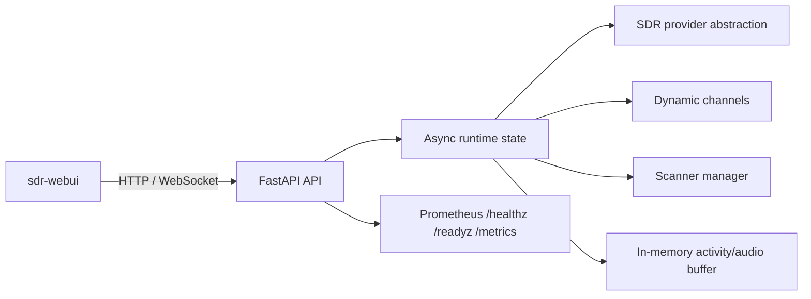

# SDR Runtime Architecture

## Overview

`sdr-runtime` is a stateless FastAPI service that owns one SDR device, a wideband capture window, dynamic channel workers, scanner definitions, in-memory activity state, and all public control APIs.

## Core Components

- **Configuration layer**: Pydantic settings load device selection, limits, startup defaults, auth, and observability controls from environment variables.
- **Radio provider layer**: the runtime can start either the real RTL-SDR provider or the mock provider. The RTL-SDR path opens hardware, applies startup settings, and exposes real device identity/capabilities; the mock path remains available for development without hardware.
- **Runtime state manager**: Holds radio state, channel objects, scanners, streams, activities, and the event bus. All mutable state is protected by a single async lock for predictable concurrency.
- **Event bus**: Stores a bounded event history and fan-outs live events to WebSocket subscribers.
- **Metrics**: Prometheus counters and gauges expose current activity and overrun counts.

## Stateful vs Stateless Design

The container is intentionally **stateless across restarts**:

- channel definitions are stored only in memory;
- scanners are stored only in memory;
- activity audio is stored only in memory with TTL cleanup;
- there is no database dependency;
- restart returns the service to a clean baseline configured only by environment variables.

## DSP Foundation

This implementation provides a production-oriented software structure instead of hardware-specific DSP glue:

1. one wideband radio state defines the current RF window;
2. API-created channels are validated against that window unless retune policy explicitly permits movement;
3. each channel maps to a logical stream object and activity thresholds;
4. scanners are separate objects with conflict checks against fixed channels.

A fuller DSP chain can be integrated behind the same API by extending the current RTL-SDR startup path and replacing the remaining simulation hooks with actual demodulator workers.

## Concurrency Model

- `RuntimeState.lock` serializes updates to mutable shared objects.
- revision numbers on radio state, channels, and scanners enable stale-write detection.
- multiple API clients can safely read concurrently while writes are guarded by the lock.

## Failure Handling

Startup and runtime guardrails include:

- unsupported startup antenna/sample rate/bandwidth values fail clearly in strict mode;
- unsupported channel modulation or out-of-window channel frequencies return `422`;
- limit exhaustion returns `409`;
- retune conflicts return `409`;
- readiness can be turned false if future SDR integration detects hardware loss.

## Extension Points

- replace `MockSdrProvider` with SoapySDR or vendor-specific bindings;
- add real PCM / RTP transports behind the `Stream` model;
- feed activity events into STT, routing, or AI pipelines externally;
- partition locking if future throughput requires narrower synchronization.
