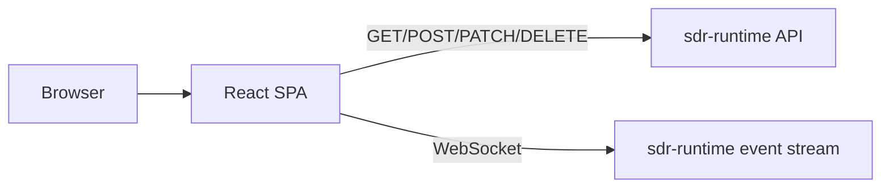

# SDR Web UI Architecture

## Overview

`sdr-webui` is a React + Vite single-page application served by NGINX. It interacts with `sdr-runtime` **only through documented public HTTP and WebSocket APIs**.

## Design Notes

- runtime connectivity is configured through environment variables rendered into `config.js` at container startup;
- the UI does not read runtime internals or shared storage;
- reconnect behavior is handled by periodic refresh plus WebSocket status changes;
- operator-focused panels group device status, channels, scanners, and live events into a single dashboard.

## Major UI Modules

- **API client**: wraps the runtime REST API and token handling.
- **Status dashboard**: shows connectivity, readiness, device identity, and operating parameters.
- **Channel management**: create/edit/delete/toggle/mute channels from a single form and table.
- **Scanner management**: manage scanner definitions, plus start/stop controls.
- **Live events**: displays recent runtime events from WebSocket history.

## Responsive Behavior

The dashboard is desktop-first, but CSS grid collapses into one-column layouts on smaller screens.
